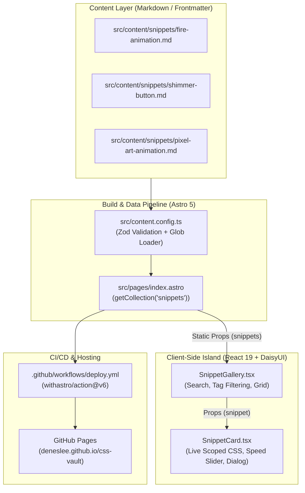

# CSS Vault — Architecture, Setup & Code Guide

CSS Vault is a modern, statically generated web showcase for interactive CSS animations, pixel-art sprite loops, and reusable UI components. It combines Astro's static site generation and content collections with interactive React client islands, styled using Tailwind CSS v4 and DaisyUI v5.

---

## 1. High-Level Architecture Overview

CSS Vault follows Astro's **Islands Architecture**:

- **Static Shell (SSG):** Astro processes content collections at build time, validates metadata against strict schemas, and generates static HTML.
- **Interactive Island:** The snippet gallery and preview cards run client-side via React (`client:load`), enabling real-time search, tag filtering, animation speed adjustment, and clipboard copying.



---

## 2. Technology Stack & Environment Setup

| Layer | Technology | Version | Purpose |
| :--- | :--- | :--- | :--- |
| **Runtime** | Node.js | `>=22.12.0` | Execution engine |
| **Package Manager** | `pnpm` | `~9+` / `pnpm-workspace.yaml` | Fast, deterministic dependency management |
| **Framework** | Astro | `^7.3.5` (Content Layer) | SSG, content loader, metadata extraction |
| **UI Integration** | React & React DOM | `^19.3.0` | Client-side reactive interactive components |
| **CSS Engine** | Tailwind CSS | `^4.3.3` | Utility styling via `@tailwindcss/vite` |
| **Component UI** | DaisyUI | `^5.7.46` | UI components (cards, badges, modals, menus) |
| **Markdown** | `@astrojs/mdx` | `^8.0.2` | Rich markdown parsing |
| **Deployment** | GitHub Actions | `deploy.yml` | Automated deployment to GitHub Pages |

### Development Setup & Commands

Run commands from the repository root:

```bash
# 1. Install dependencies
pnpm install

# 2. Run local development server
pnpm dev
# Or run in background mode as documented in AGENTS.md:
astro dev --background

# 3. Type check & content schema check
pnpm check

# 4. Production build (outputs to ./dist)
pnpm build

# 5. Preview production build locally
pnpm preview
```

---

## 3. Directory Structure

```text
css-vault/
├── .github/workflows/
│   └── deploy.yml              # GitHub Pages CI/CD workflow
├── public/                     # Static assets served at root
│   ├── assets/                 # Sprite sheets & textures (e.g. fire_sprite_64.png)
│   ├── sprites/                # Character sprites (e.g. runner.png)
│   └── favicon.svg             # Site favicon
├── src/
│   ├── components/
│   │   ├── Navbar.astro        # Standalone Astro navbar (legacy / custom CSS)
│   │   ├── SnippetCard.tsx     # React component: live preview, speed slider, code modal
│   │   ├── SnippetGallery.tsx  # React component: search filter, tag filter, responsive grid
│   │   └── Welcome.astro       # Starter template component (unused)
│   ├── content/
│   │   └── snippets/           # Markdown snippet definitions with metadata
│   │       ├── fire-animation.md
│   │       ├── pixel-art-animation.md
│   │       ├── shimmer-button.md
│   │       └── snippet.template.md
│   ├── layouts/
│   │   └── Layout.astro        # Global page layout template
│   ├── pages/
│   │   └── index.astro         # Main homepage entry point
│   ├── styles/
│   │   ├── global.css          # Tailwind CSS v4 & DaisyUI v5 entry point
│   │   └── snippet-card.css    # Standalone CSS styles (reference / alternative)
│   └── content.config.ts       # Astro Content Collections configuration & Zod schema
├── astro.config.mjs            # Astro configuration (base path, site, Vite Tailwind plugin)
├── package.json                # Dependencies and script definitions
├── pnpm-workspace.yaml         # PNPM workspace setup
└── tsconfig.json               # TypeScript strict configuration
```

---

## 4. How the Code Works: Step-by-Step

### Step 1: Content Collection Definition & Validation

Files: [`src/content.config.ts`](file:///c:/Users/leede/Documents/Projects/css-vault/src/content.config.ts), [`src/content/snippets/`](file:///c:/Users/leede/Documents/Projects/css-vault/src/content/snippets)

Astro's Content Collections API loads snippets from markdown files using the modern `glob` loader. Each snippet file contains YAML frontmatter defining the snippet attributes and pure code representations:

```typescript
// src/content.config.ts
import { defineCollection, z } from "astro:content";
import { glob } from "astro/loaders";

const snippets = defineCollection({
  loader: glob({ pattern: "**/*.{md,mdx}", base: "./src/content/snippets" }),
  schema: z.object({
    title: z.string(),
    category: z.string(),
    tags: z.array(z.string()).default([]),
    defaultSpeed: z.number().default(1),
    cssCode: z.string(),
    htmlCode: z.string(),
    reactCode: z.string(),
  }),
});

export const collections = { snippets };
```

Each markdown file (e.g. `shimmer-button.md`, `fire-animation.md`) encodes:

- `title`, `category`, and `tags` for classification and filtering.
- `defaultSpeed` (seconds) for dynamic animation scaling.
- `cssCode`, `htmlCode`, and `reactCode` ready for instant copy and execution.
- Markdown body content containing implementation notes and explanations.

---

### Step 2: Static Page Data Assembly

File: [`src/pages/index.astro`](file:///c:/Users/leede/Documents/Projects/css-vault/src/pages/index.astro)

During build time, Astro executes the frontmatter script block:

1. `getCollection("snippets")` reads and validates all snippet markdown files against the Zod schema.
2. The raw collection entries are flattened into clean `SnippetData` objects.
3. The page imports `src/styles/global.css`, linking Tailwind CSS v4 and DaisyUI.
4. The page embeds the interactive React island `<SnippetGallery snippets={snippets} client:load />`, delivering pre-rendered HTML that immediately hydrates in the browser.

```astro
---
import { getCollection } from "astro:content";
import SnippetGallery from "../components/SnippetGallery";
import "../styles/global.css";

const rawSnippets = await getCollection("snippets");

const snippets = rawSnippets.map((entry) => ({
  id: entry.id,
  title: entry.data.title,
  category: entry.data.category,
  tags: entry.data.tags,
  defaultSpeed: entry.data.defaultSpeed,
  cssCode: entry.data.cssCode,
  htmlCode: entry.data.htmlCode,
  reactCode: entry.data.reactCode,
}));
---

<html lang="en" data-theme="dark">
  <head>
    <meta charset="utf-8" />
    <meta name="viewport" content="width=device-width, initial-scale=1" />
    <title>CSS Vault</title>
  </head>
  <body>
    <SnippetGallery snippets={snippets} client:load />
  </body>
</html>
```

---

### Step 3: Interactive Gallery Filtering

File: [`src/components/SnippetGallery.tsx`](file:///c:/Users/leede/Documents/Projects/css-vault/src/components/SnippetGallery.tsx)

`SnippetGallery` provides instant, client-side filtering without page reloads:

- **Search Query (`search` state):** Filters snippets by `title` or `category` case-insensitively.
- **Tag Filter (`selectedTag` state):** Aggregates all unique tags across all snippets into interactive badges (`#button`, `#fire`, `#sprite-sheet`, etc.).
- **Memoized Filtering:** Computes `filteredSnippets` using `useMemo`, ensuring zero wasted renders during rapid keystrokes.
- **Responsive Grid:** Renders cards in a 1-column (mobile), 2-column (tablet), or 3-column (desktop) CSS grid using DaisyUI utility classes.

---

### Step 4: Live Preview & Dynamic Animation Scoping

File: [`src/components/SnippetCard.tsx`](file:///c:/Users/leede/Documents/Projects/css-vault/src/components/SnippetCard.tsx)

Each snippet card provides a self-contained runtime environment:

1. **Unique Scoped ID:**

   ```typescript
   const modalId = useId().replace(/:/g, "");
   ```

   Uses React's `useId()` stripped of colons to generate safe, unique DOM IDs for each card instance.

2. **Scoped Inline Styles & Variable Injection:**

   ```tsx
   <style
     dangerouslySetInnerHTML={{
       __html: `
         #preview-${modalId} {
           --fire-duration: ${speed}s;
         }
         ${snippet.cssCode}
       `,
     }}
   />
   ```

   Injects the snippet's raw CSS directly into the page, scoped to that specific card's preview element `#preview-${modalId}`.

3. **Real-Time Speed Manipulation:**
   An HTML5 range slider (`<input type="range" min="0.2" max="4" step="0.1" value={speed} />`) allows users to slow down or speed up the animation in real time. Changing the slider updates the React state `speed`, dynamically updating the injected CSS custom property.

4. **Multi-Format Clipboard System:**
   Users can click "Copy CSS", "React", or access the dropdown menu to copy pure "HTML". A 2-second transient badge (`copiedType`) confirms successful copying.

5. **Code Inspection Modal:**
   Clicking "Show Code" opens an accessible DaisyUI `<dialog>` modal with tabs for CSS, React Component, and HTML, pre-formatted inside `<pre><code>`.

---

## 5. Deployment Pipeline

File: [`.github/workflows/deploy.yml`](file:///c:/Users/leede/Documents/Projects/css-vault/.github/workflows/deploy.yml)

The project is configured for continuous deployment to GitHub Pages on every push to the `main` branch:

1. **Astro Base Configuration:**
   [`astro.config.mjs`](file:///c:/Users/leede/Documents/Projects/css-vault/astro.config.mjs) specifies:
   - `site: 'https://deneslee.github.io'`
   - `base: '/css-vault'`
   All generated static routes are prefixed with `/css-vault/`.

2. **GitHub Action Execution:**
   - Checks out the repository (`actions/checkout@v7`).
   - Uses `withastro/action@v6` which auto-detects `pnpm`, installs dependencies, and runs `astro build`.
   - Deploys the `./dist` folder to GitHub Pages via `actions/deploy-pages@v5`.

---

## 6. How to Add a New CSS Snippet

To introduce a new animation or UI component into the vault:

1. Create a new markdown file in `src/content/snippets/my-effect.md` (or copy `src/content/snippets/snippet.template.md`).
2. Populate the required frontmatter properties:

```markdown
---
title: "Glowing Neon Border"
category: "Borders & Shadows"
tags: ["border", "glow", "neon", "box-shadow"]
defaultSpeed: 1.5
cssCode: |
  .neon-border {
    padding: 1rem 2rem;
    color: #38bdf8;
    border: 2px solid #38bdf8;
    border-radius: 8px;
    box-shadow: 0 0 15px rgba(56, 189, 248, 0.6);
    animation: neon-pulse var(--anim-speed, 1.5s) ease-in-out infinite alternate;
  }

  @keyframes neon-pulse {
    from { box-shadow: 0 0 5px rgba(56, 189, 248, 0.4); }
    to { box-shadow: 0 0 25px rgba(56, 189, 248, 0.9); }
  }
htmlCode: |
  <div class="neon-border">Neon Glow</div>
reactCode: |
  import React from 'react';

  export function NeonBorder({ speed = 1.5 }) {
    return (
      <div
        className="neon-border"
        style={{ '--anim-speed': `${speed}s` } as React.CSSProperties}
      >
        Neon Glow
      </div>
    );
  }
---

### Implementation Notes

Uses alternating box-shadow keyframes combined with CSS custom properties to allow external timing adjustments.
```

1. If your snippet uses sprite sheets or image textures, place the image files in `public/assets/` or `public/sprites/`.
2. Astro's hot module reloading immediately compiles the new file and updates the gallery.

---

## 7. Observations & Engineering Recommendations

1. **Animation Speed Variable Standardization:**
   In [`SnippetCard.tsx`](file:///c:/Users/leede/Documents/Projects/css-vault/src/components/SnippetCard.tsx#L34), line 34 injects `--fire-duration: ${speed}s;`. However, snippets like `shimmer-button.md` use `--anim-speed` and `pixel-art-animation.md` uses `--run-speed`.
   *Recommendation:* Standardize on `--anim-speed: ${speed}s;` (or inject multiple aliases like `--anim-speed`, `--fire-duration`, `--speed`, and `--duration`) so that all snippets respond dynamically to the speed slider.

2. **Asset Path Resolution under GitHub Pages Base Path:**
   `astro.config.mjs` sets `base: '/css-vault'`. Assets stored in `public/` that are referenced with absolute root paths (such as `url('/assets/fire_sprite_64.png')` or `url('/sprites/runner.png')`) will resolve to root `deneslee.github.io/assets/...` instead of `deneslee.github.io/css-vault/assets/...` in production unless prefixed or made relative.
   *Recommendation:* Use relative paths (e.g. `assets/fire_sprite_64.png` or `import.meta.env.BASE_URL + 'assets/...'`) in snippet CSS code.

3. **Consolidation of Layout and Navbar:**
   [`src/pages/index.astro`](file:///c:/Users/leede/Documents/Projects/css-vault/src/pages/index.astro) currently defines its own `<html>` structure and embeds a DaisyUI navbar inside `SnippetGallery.tsx`, leaving [`src/layouts/Layout.astro`](file:///c:/Users/leede/Documents/Projects/css-vault/src/layouts/Layout.astro) and [`src/components/Navbar.astro`](file:///c:/Users/leede/Documents/Projects/css-vault/src/components/Navbar.astro) unreferenced.
   *Recommendation:* Either wrap `index.astro` with `Layout.astro` for consistent site metadata/SEO, or deprecate the unused legacy components.
